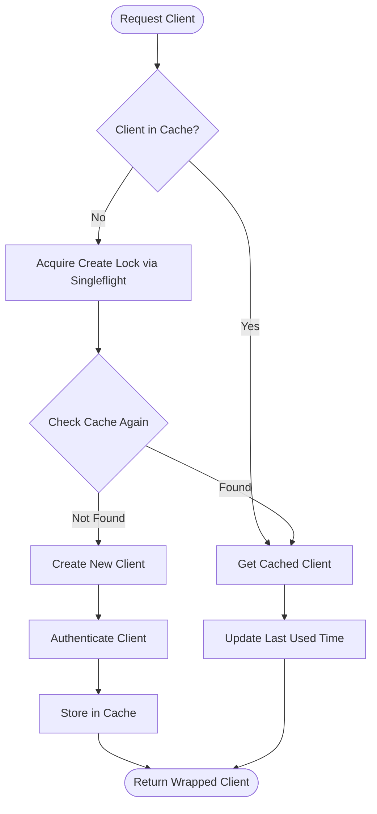
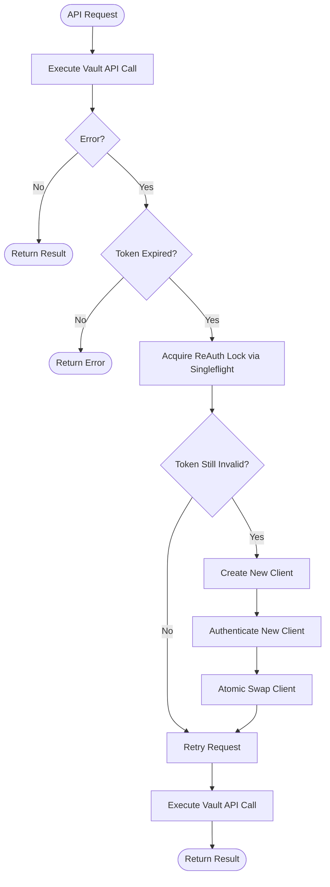
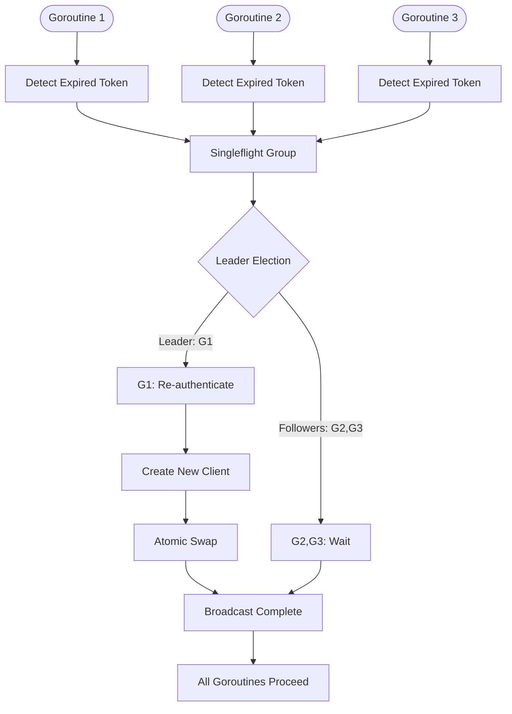

# Vault Client Caching Design (PRELIMINARY - OUTDATED)

> **⚠️ WARNING: This document is preliminary and outdated.**
>
> **Please refer to [DESIGN.md](./DESIGN.md) as the authoritative source of truth for the Vault Client Pooling implementation.**
>
> This document contains early design exploration and may not reflect current decisions.

---

## Executive Summary

This document outlines the design for implementing a thread-safe Vault client caching mechanism in the External Secrets Operator to minimize unnecessary Vault API calls while handling token expiration and concurrent access patterns gracefully.

## Core Requirements

1. **Cache Reuse**: Reuse Vault clients across multiple SecretStore, ClusterSecretStore, and VaultDynamicSecret resources when they share the same authentication configuration
2. **Thread Safety**: Handle concurrent reconciliations accessing the same cached client
3. **Token Expiration**: Transparently handle token expiration without causing reconciliation failures
4. **Credential Rotation Detection**: Detect credential changes immediately through fresh credential reads on every reconciliation
5. **No Sensitive Credential Storage**: Never store actual credentials, only metadata
6. **Performance Optimization**: Reduce expensive Vault authentication calls (85ms) while accepting cheap K8s reads (15ms)

## Cache Key Design

### Credential Rotation Strategy

Since we read K8s credentials on every reconciliation (required for authentication anyway), we get credential metadata for free. This enables immediate rotation detection without storing sensitive data.

### Cache Key Design

The cache key enables maximum client sharing while detecting credential changes through fresh metadata:

```go
type VaultCacheKey struct {
    // Core Vault configuration
    ServerURL      string // Vault server address
    VaultNamespace string // Vault namespace (for multi-tenant)

    // Authentication configuration
    AuthMethod     string // kubernetes, token, approle, jwt, etc.
    AuthMountPath  string // Custom auth mount path
    Role           string // Role name for role-based auth

    // Kubernetes context
    K8sNamespace   string // Kubernetes namespace for resource isolation

    // Optional: CA configuration
    CACertHash     string // SHA-256 of custom CA certificate (if provided)

    // Credential change detection (universal for all auth methods)
    CredentialIdentifier string // Changes when credentials change, no sensitive data
}
```

### Credential Hints by Auth Method

```go
func getCredentialHint(auth *esv1.VaultAuth) string {
    switch {
    case auth.Kubernetes != nil:
        // ServiceAccount name changes would invalidate
        return fmt.Sprintf("k8s:%s", auth.Kubernetes.ServiceAccountRef.Name)

    case auth.AppRole != nil:
        // RoleID is not sensitive (SecretID is)
        return fmt.Sprintf("approle:%s", auth.AppRole.RoleID)

    case auth.Jwt != nil:
        // JWT role is not sensitive
        return fmt.Sprintf("jwt:%s", auth.Jwt.Role)

    case auth.TokenSecretRef != nil:
        // Reference name (not the token itself)
        return fmt.Sprintf("token:%s:%s",
            auth.TokenSecretRef.Name,
            auth.TokenSecretRef.Key)

    case auth.Cert != nil:
        // Certificate reference (not the cert itself)
        if auth.Cert.ClientCert != nil {
            return fmt.Sprintf("cert:%s", auth.Cert.ClientCert.Name)
        }
    }
    return "default"
}
```

### Key Generation

```go
func GenerateCacheKey(config *VaultConfig) string {
    key := VaultCacheKey{
        ServerURL:      config.Server,
        VaultNamespace: config.Namespace,
        AuthMethod:     config.Auth.Method,
        AuthMountPath:  config.Auth.MountPath,
        Role:           config.Auth.Role,
        K8sNamespace:   config.K8sNamespace,
        CACertHash:     hashCACert(config.CABundle),
    }

    // Serialize to deterministic string
    return fmt.Sprintf("%s:%s:%s:%s:%s:%s:%s",
        key.ServerURL,
        key.VaultNamespace,
        key.AuthMethod,
        key.AuthMountPath,
        key.Role,
        key.K8sNamespace,
        key.CACertHash,
    )
}
```

## Resource Type Support

### SecretStore
- **Scope**: Namespace-scoped
- **Cache Key**: Includes namespace and ResourceVersion in key
- **Client Reuse**: Within same namespace for identical configurations
- **Cache Behavior**: ResourceVersion change creates new cache key (automatic cache miss)

### ClusterSecretStore
- **Scope**: Cluster-wide
- **Cache Key**: May spawn multiple clients (one per namespace if using referent auth)
- **Client Reuse**: Across namespaces if same auth config and ResourceVersion
- **Cache Behavior**: ResourceVersion change creates new cache key (automatic cache miss)

### VaultDynamicSecret
- **Scope**: Namespace-scoped generator
- **Cache Key**: Reuses same pattern as SecretStore
- **Client Reuse**: Shares clients with SecretStore/ClusterSecretStore if identical cache keys
- **Special Handling**: Uses `NewGeneratorClient` but same caching logic

```go
// Unified cache key generation for all resource types
// CRITICAL: Must enable sharing across SecretStore, ClusterSecretStore, and VaultDynamicSecret
func GenerateCacheKey(ctx context.Context, namespace string,
    vaultSpec *esv1.VaultProvider, kube client.Client,
    corev1 typedcorev1.CoreV1Interface) (string, error) {

    // Get credential identifier (reads K8s resources if needed)
    credentialID, err := getCredentialIdentifier(ctx, vaultSpec.Auth,
        kube, corev1, namespace)
    if err != nil {
        return "", fmt.Errorf("failed to get credential identifier: %w", err)
    }

    key := VaultCacheKey{
        ServerURL:            vaultSpec.Server,
        VaultNamespace:       vaultSpec.Namespace,
        AuthMethod:           getAuthMethod(vaultSpec.Auth),
        AuthMountPath:        getAuthMountPath(vaultSpec.Auth),
        Role:                 getAuthRole(vaultSpec.Auth),
        K8sNamespace:         namespace,
        CACertHash:           hashCACert(vaultSpec.CABundle),
        CredentialIdentifier: credentialID, // Universal identifier
    }

    // Special handling for ClusterSecretStore with referent auth
    if isReferentAuth(vaultSpec) {
        key.K8sNamespace = namespace // Use referent namespace
    }

    return serializeKey(key), nil
}

// Abstract credential identifier generation for all auth methods
type CredentialIdentifier interface {
    // Returns a stable identifier for the current credentials
    // This should change when credentials change but not contain sensitive data
    GetCredentialIdentifier(ctx context.Context) (string, error)
}

// Unified function to get credential identifier for any auth method
func getCredentialIdentifier(ctx context.Context, auth *esv1.VaultAuth,
    kube client.Client, corev1 typedcorev1.CoreV1Interface,
    namespace string) (string, error) {

    if auth == nil {
        return "no-auth", nil
    }

    switch {
    case auth.Kubernetes != nil:
        // Kubernetes ServiceAccount auth
        k8sAuth := auth.Kubernetes
        sa := k8sAuth.ServiceAccountRef

        // For Kubernetes auth, tokens are created dynamically during auth
        // We need to track if the ServiceAccount itself changes
        // Option 1: Track SA generation if available
        if sa.Generation != nil {
            return fmt.Sprintf("k8s-sa:%s:%s:gen:%d",
                sa.Name,
                k8sAuth.Role,
                *sa.Generation), nil
        }

        // Option 2: Get SA and check its ResourceVersion
        saObj, err := corev1.ServiceAccounts(namespace).Get(ctx, sa.Name, metav1.GetOptions{})
        if err != nil {
            // If we can't get SA, use time epoch as fallback
            epoch := time.Now().Unix() / (5 * 60) // 5-minute epochs
            return fmt.Sprintf("k8s-sa:%s:%s:epoch:%d",
                sa.Name,
                k8sAuth.Role,
                epoch), nil
        }

        return fmt.Sprintf("k8s-sa:%s:%s:rv:%s",
            sa.Name,
            k8sAuth.Role,
            saObj.ResourceVersion), nil

    case auth.AppRole != nil && auth.AppRole.SecretRef != nil:
        // Read Secret to get ResourceVersion
        secret, err := kube.GetSecret(ctx, auth.AppRole.SecretRef, namespace)
        if err != nil {
            return "", err
        }
        // Include RoleID (not sensitive) and Secret version
        return fmt.Sprintf("approle:%s:v:%s",
            auth.AppRole.RoleID,
            secret.ResourceVersion), nil

    case auth.TokenSecretRef != nil:
        // Read Secret to get ResourceVersion
        secret, err := kube.GetSecret(ctx, auth.TokenSecretRef, namespace)
        if err != nil {
            return "", err
        }
        return fmt.Sprintf("token:v:%s", secret.ResourceVersion), nil

    case auth.Jwt != nil:
        if auth.Jwt.SecretRef != nil {
            // JWT from Secret
            secret, err := kube.GetSecret(ctx, auth.Jwt.SecretRef, namespace)
            if err != nil {
                return "", err
            }
            return fmt.Sprintf("jwt:%s:v:%s", auth.Jwt.Role, secret.ResourceVersion), nil
        } else if auth.Jwt.KubernetesServiceAccountToken != nil {
            // Dynamic SA token
            sa := auth.Jwt.KubernetesServiceAccountToken.ServiceAccountRef
            epoch := time.Now().Unix() / (5 * 60) // 5-minute epochs
            return fmt.Sprintf("jwt-sa:%s:epoch:%d", sa.Name, epoch), nil
        }

    case auth.Cert != nil:
        // Certificate auth
        if auth.Cert.ClientCert != nil && auth.Cert.ClientKey != nil {
            certSecret, err := kube.GetSecret(ctx, auth.Cert.ClientCert, namespace)
            if err != nil {
                return "", err
            }
            keySecret, err := kube.GetSecret(ctx, auth.Cert.ClientKey, namespace)
            if err != nil {
                return "", err
            }
            return fmt.Sprintf("cert:v:%s:%s",
                certSecret.ResourceVersion,
                keySecret.ResourceVersion), nil
        }

    case auth.Iam != nil:
        // AWS IAM auth - need to track actual AWS credentials
        iamAuth := auth.Iam

        // Get current AWS credentials (from provider chain)
        creds, err := getAWSCredentials(ctx, iamAuth)
        if err != nil {
            return "", fmt.Errorf("failed to get AWS credentials: %w", err)
        }

        // Create digest of credentials (not storing sensitive data)
        // Include session token for temporary creds, or access key ID for static
        var credentialID string
        if creds.SessionToken != "" {
            // Temporary credentials - hash the session token
            h := sha256.Sum256([]byte(creds.SessionToken))
            credentialID = fmt.Sprintf("sts:%x", h[:8]) // First 8 bytes of hash
        } else {
            // Static or instance credentials - use access key ID
            credentialID = fmt.Sprintf("akid:%s", creds.AccessKeyID)
        }

        return fmt.Sprintf("iam:%s:%s:%s",
            iamAuth.Region,
            iamAuth.VaultRole,
            credentialID), nil

    case auth.Ldap != nil:
        // LDAP credentials from Secret
        secret, err := kube.GetSecret(ctx, auth.Ldap.SecretRef, namespace)
        if err != nil {
            return "", err
        }
        return fmt.Sprintf("ldap:%s:v:%s",
            auth.Ldap.Username,
            secret.ResourceVersion), nil

    case auth.UserPass != nil:
        // UserPass credentials from Secret
        secret, err := kube.GetSecret(ctx, auth.UserPass.SecretRef, namespace)
        if err != nil {
            return "", err
        }
        return fmt.Sprintf("userpass:%s:v:%s",
            auth.UserPass.Username,
            secret.ResourceVersion), nil
    }

    return "unknown-auth", nil
}

// Helper function to get AWS credentials and track rotation
func getAWSCredentials(ctx context.Context, iamAuth *esv1.VaultIAMAuth) (*AWSCredentials, error) {
    // This would use the same credential chain as the actual IAM auth
    // 1. Check for explicit credentials in Secret
    if iamAuth.SecretRef != nil {
        secret, err := kube.GetSecret(ctx, iamAuth.SecretRef, namespace)
        if err != nil {
            return nil, err
        }
        return &AWSCredentials{
            AccessKeyID:     string(secret.Data["access-key"]),
            SecretAccessKey: string(secret.Data["secret-key"]),
            SessionToken:    string(secret.Data["session-token"]),
        }, nil
    }

    // 2. Use AWS SDK credential chain (instance profile, ECS, etc.)
    sess, err := session.NewSession(&aws.Config{Region: &iamAuth.Region})
    if err != nil {
        return nil, err
    }

    creds, err := sess.Config.Credentials.Get()
    if err != nil {
        return nil, err
    }

    return &AWSCredentials{
        AccessKeyID:     creds.AccessKeyID,
        SecretAccessKey: creds.SecretAccessKey,
        SessionToken:    creds.SessionToken,
    }, nil
}
```

## Architecture Design

### Core Components

```go
type VaultClientCache struct {
    cache      map[string]*CachedClient
    cacheMutex sync.RWMutex

    // Deduplication for concurrent client creation
    createGroup singleflight.Group

    // Configuration
    maxSize    int
    ttl        time.Duration

    // Metrics
    metrics    CacheMetrics
}

type CachedClient struct {
    client       *vault.Client
    clientMutex  sync.RWMutex

    // Metadata
    createdAt    time.Time
    lastUsed     time.Time
    useCount     int64

    // Re-authentication state
    reAuthGroup  singleflight.Group
    authConfig   *AuthConfig // Stores auth method, not credentials
}

type WrappedVaultClient struct {
    *CachedClient
    cache *VaultClientCache
    key   string
}
```

## Flow Diagrams

### 1. Client Acquisition Flow



### 2. Token Expiration Handling Flow



### 3. Concurrent Access Patterns



## Implementation Details

### 1. Client Wrapper with Automatic Retry

```go
func (w *WrappedVaultClient) Request(operation func(*vault.Client) error) error {
    maxRetries := 2

    for attempt := 0; attempt < maxRetries; attempt++ {
        client := w.getClient()
        err := operation(client)

        if err == nil {
            return nil
        }

        if isTokenExpiredError(err) {
            // Use singleflight to ensure only one re-authentication
            _, err, _ := w.reAuthGroup.Do("reauth", func() (interface{}, error) {
                return nil, w.reAuthenticate()
            })

            if err != nil {
                return fmt.Errorf("re-authentication failed: %w", err)
            }

            // Retry with new client
            continue
        }

        return err
    }

    return fmt.Errorf("max retries exceeded")
}

func (w *WrappedVaultClient) reAuthenticate() error {
    // Create new client with fresh authentication
    newClient, err := createAndAuthenticateClient(w.authConfig)
    if err != nil {
        return err
    }

    // Atomic swap
    w.clientMutex.Lock()
    w.client = newClient
    w.clientMutex.Unlock()

    return nil
}
```

### 2. Cache Management

```go
func (c *VaultClientCache) GetOrCreate(key string, config *VaultConfig) (*WrappedVaultClient, error) {
    // Fast path: check if client exists
    c.cacheMutex.RLock()
    if cached, exists := c.cache[key]; exists {
        cached.updateLastUsed()
        c.cacheMutex.RUnlock()
        return &WrappedVaultClient{
            CachedClient: cached,
            cache:        c,
            key:          key,
        }, nil
    }
    c.cacheMutex.RUnlock()

    // Slow path: create new client (deduplicated via singleflight)
    val, err, _ := c.createGroup.Do(key, func() (interface{}, error) {
        // Double-check after acquiring lock
        c.cacheMutex.RLock()
        if cached, exists := c.cache[key]; exists {
            c.cacheMutex.RUnlock()
            return cached, nil
        }
        c.cacheMutex.RUnlock()

        // Create and authenticate new client
        client, err := createAndAuthenticateClient(config)
        if err != nil {
            return nil, err
        }

        cached := &CachedClient{
            client:     client,
            createdAt:  time.Now(),
            lastUsed:   time.Now(),
            authConfig: extractAuthConfig(config),
        }

        // Store in cache
        c.cacheMutex.Lock()
        c.cache[key] = cached
        c.enforceMaxSize()
        c.cacheMutex.Unlock()

        return cached, nil
    })

    if err != nil {
        return nil, err
    }

    return &WrappedVaultClient{
        CachedClient: val.(*CachedClient),
        cache:        c,
        key:          key,
    }, nil
}
```

### 3. TTL-Based Eviction

```go
func (c *VaultClientCache) startEvictionLoop() {
    ticker := time.NewTicker(1 * time.Minute)

    go func() {
        for range ticker.C {
            c.evictStaleClients()
        }
    }()
}

func (c *VaultClientCache) evictStaleClients() {
    now := time.Now()

    c.cacheMutex.Lock()
    defer c.cacheMutex.Unlock()

    for key, cached := range c.cache {
        if now.Sub(cached.lastUsed) > c.ttl {
            delete(c.cache, key)
            c.metrics.recordEviction("ttl")
        }
    }
}
```

## Edge Case Handling

### 1. Concurrent Client Creation
- **Solution**: Singleflight pattern ensures only one goroutine creates the client while others wait
- **Implementation**: `createGroup.Do(key, createFunc)` deduplicates concurrent creation attempts

### 2. Concurrent Token Expiration Detection
- **Solution**: Per-client singleflight group for re-authentication
- **Implementation**: `reAuthGroup.Do("reauth", reAuthFunc)` ensures single re-authentication

### 3. In-Flight Requests During Token Swap
- **Solution**: Atomic client replacement - old requests complete with old client, new requests use new client
- **Implementation**: Create new client instance and swap pointer atomically

### 4. Configuration Changes
- **Solution**: Cache invalidation triggered by reconciler when SecretStore/ClusterSecretStore updates
- **Implementation**: `cache.Invalidate(key)` method exposed to reconcilers

### 5. Memory Management
- **Solution**: Maximum cache size with LRU eviction and TTL-based cleanup
- **Implementation**: `enforceMaxSize()` called after each insertion; metrics focus on automatic evictions (manual removals for config drift/auth failure are ignored to keep dashboards meaningful)

### 6. Network Failures During Re-authentication
- **Solution**: Exponential backoff with circuit breaker pattern
- **Implementation**: Wrapped in retry logic with increasing delays

## Configuration Options

```yaml
vaultClientCache:
  enabled: true
  maxSize: 100              # Maximum number of cached clients
  ttl: 15m                  # Time-to-live for idle clients
  evictionInterval: 1m      # How often to run eviction
  metricsEnabled: true      # Enable cache metrics
```

## Metrics and Observability

```go
type CacheMetrics struct {
    hits        prometheus.Counter
    misses      prometheus.Counter
    evictions   *prometheus.CounterVec // by reason: ttl, size, manual
    size        prometheus.Gauge
    reAuthCount prometheus.Counter
}
```

## Credential Rotation Handling

### Detection Strategies

1. **Fresh Credential Reads**: Every reconciliation reads credential Secrets (required for auth)
2. **ResourceVersion in Cache Key**: Credential Secret's ResourceVersion ensures cache miss on changes
3. **Lazy Token Expiration Handling**: Auth errors trigger cache removal and retry
4. **No Background Tasks**: All operations driven by reconciliation, no watchers or timers

### Failure Modes and Recovery

```go
// Enhanced error detection for credential issues
func isCredentialError(err error) bool {
    if err == nil {
        return false
    }

    errStr := err.Error()
    return strings.Contains(errStr, "authentication failed") ||
           strings.Contains(errStr, "invalid credentials") ||
           strings.Contains(errStr, "unauthorized") ||
           strings.Contains(errStr, "permission denied")
}

// Cache invalidation on credential errors
func (w *WrappedVaultClient) handleError(err error) error {
    if isCredentialError(err) {
        // Invalidate this client from cache
        w.cache.Invalidate(w.key)

        // Force re-authentication on next request
        w.markForReAuth()
    }
    return err
}
```

### Edge Cases

1. **Credential Rotation During Long-Running Token**
   - **Problem**: New credentials deployed but old token still valid
   - **Solution**: Token continues working until expiration, then re-auth fails
   - **Recovery**: Authentication error triggers cache invalidation and retry with new creds
   - **Option**: Add credential Secret watching for immediate invalidation

2. **Partial Credential Update**
   - **Problem**: Only SecretID changed, not RoleID
   - **Detection**: Delayed until token expires (unless Secret watching enabled)
   - **Recovery**: Auth failure triggers re-authentication with updated credentials

3. **Maximum Resource Sharing**
   - **Scenario**: Multiple SecretStores, ClusterSecretStores, and VaultDynamicSecrets
   - **Result**: All share same cached client if Vault config matches
   - **Benefit**: Single authentication for all resources

4. **Rapid Credential Rotation**
   - **Problem**: Credentials rotated faster than token lifetime
   - **Impact**: Each rotation only detected on next authentication
   - **Mitigation**: Shorter token TTLs or credential Secret watching

### Operational Considerations

```yaml
vaultClientCache:
  enabled: true

  # Credential validation settings
  validationInterval: 5m     # How often to validate cached tokens
  maxTokenAge: 1h            # Force re-auth after this duration

  # Cache invalidation
  invalidateOnError: true    # Clear cache on auth errors
  invalidateOnUpdate: true   # Clear cache on resource updates
```

## Security Considerations

1. **No Credential Storage**: Cache keys contain only configuration metadata, never credentials
2. **Token Isolation**: Each cached client maintains its own token, preventing cross-contamination
3. **Secure Cleanup**: Tokens are revoked (if possible) when clients are evicted
4. **Audit Trail**: All cache operations are logged for security auditing

## Testing Strategy

1. **Unit Tests**:
   - Cache key generation consistency
   - Concurrent access patterns
   - Token expiration detection
   - Client swapping logic

2. **Integration Tests**:
   - Multiple reconcilers sharing same client
   - Token expiration during active use
   - Cache eviction under memory pressure
   - Configuration change handling

3. **Load Tests**:
   - High concurrency scenarios
   - Cache performance under load
   - Memory usage patterns

## Migration Path

1. **Phase 1**: Implement cache behind feature flag (disabled by default)
2. **Phase 2**: Enable for specific namespaces via annotation
3. **Phase 3**: Gradual rollout with metrics monitoring
4. **Phase 4**: Enable by default with opt-out option

## Conclusion

This design provides a robust, thread-safe Vault client caching mechanism that:
- Significantly reduces Vault API calls across SecretStore, ClusterSecretStore, and VaultDynamicSecret resources
- Handles token expiration transparently with automatic re-authentication
- Detects credential rotations through ResourceVersion tracking and credential hints
- Manages concurrent access efficiently using singleflight patterns
- Avoids storing sensitive credentials while enabling change detection
- Provides comprehensive observability and operational controls

The atomic client swapping approach ensures that in-flight requests are never disrupted while enabling seamless token renewal. The combination of ResourceVersion tracking, credential hints, and periodic validation ensures that credential rotations are detected promptly, striking a balance between performance optimization and security requirements.
