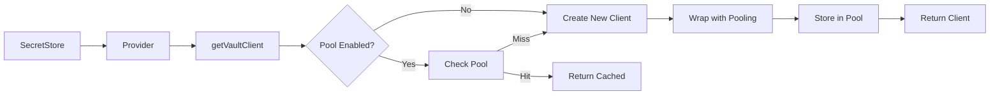
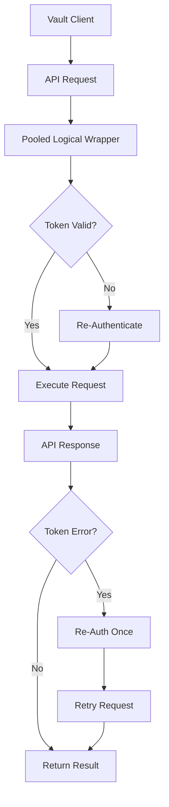
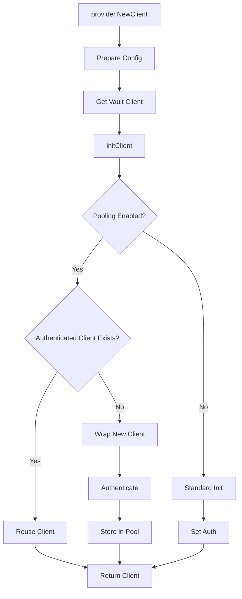
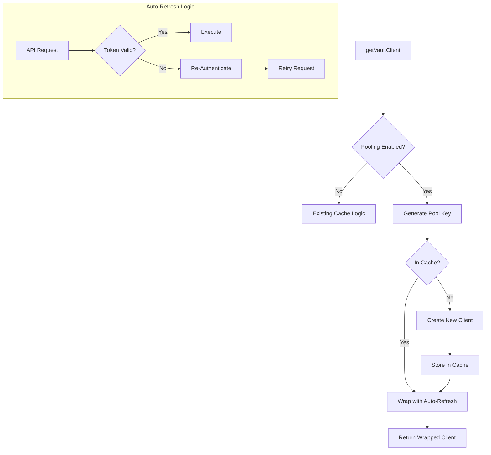

# Vault Client Pooling Integration Design (PRELIMINARY - OUTDATED)

> **⚠️ WARNING: This document is preliminary and outdated.**
>
> **Please refer to [DESIGN.md](./DESIGN.md) as the authoritative source of truth for the Vault Client Pooling implementation.**
>
> This document contains early integration exploration and may not reflect final decisions.

---

## Executive Summary

After analyzing the provider/vault package structure, I've revised the design to follow KISS (Keep It Simple, Stupid), DRY (Don't Repeat Yourself), and YAGNI (You Aren't Gonna Need It) principles. The existing codebase already has a simple cache mechanism in `provider.go:220-250`, but it lacks token expiration handling and proper concurrent access patterns.

## Revised Design Based on KISS/DRY/YAGNI

### KISS Simplifications
1. **Removed**: Complex LRU eviction, metrics collection, circuit breakers
2. **Kept**: Simple TTL-based eviction (already partially exists)
3. **Reuse**: Existing `cache.Cache` structure from `pkg/cache`
4. **Minimal**: Only handle token expiration, not complex retry logic

### DRY Optimizations
1. **Reuse**: Existing authentication logic in `auth.go`
2. **Leverage**: Current `util.Client` interface and wrapper
3. **Extend**: Existing cache key generation pattern

### YAGNI Eliminations
1. **No** branch tracking or revision systems
2. **No** complex singleflight patterns (use simple mutex)
3. **No** configurable eviction strategies
4. **No** separate metrics system

## Simplified Cache Key with Universal Credential Tracking

```go
// Cache key with credential identifier for all auth methods
type VaultPoolKey struct {
    Server               string // Vault server URL
    Namespace            string // Vault namespace
    AuthMethod           string // Auth type identifier
    AuthPath             string // Auth mount path
    K8sNamespace         string // K8s namespace for isolation
    CredentialIdentifier string // Universal credential identifier (changes on rotation)
}

// Generate cache key with fresh credential reads
func getCacheKey(ctx context.Context, vaultSpec *esv1.VaultProvider,
    namespace string, kube client.Client, corev1 typedcorev1.CoreV1Interface) (string, error) {

    // Get credential identifier (reads K8s resources as needed)
    credID, err := getCredentialIdentifier(ctx, vaultSpec.Auth, kube, corev1, namespace)
    if err != nil {
        return "", err
    }

    return fmt.Sprintf("%s|%s|%s|%s|%s",
        vaultSpec.Server,
        vaultSpec.Namespace,
        getAuthIdentifier(vaultSpec.Auth),
        namespace,
        credID) // Changes when credentials change
}

// Credential identifier for all auth types
func getCredentialIdentifier(ctx context.Context, auth *esv1.VaultAuth,
    kube client.Client, corev1 typedcorev1.CoreV1Interface, namespace string) (string, error) {

    switch {
    case auth.Kubernetes != nil:
        // Track ServiceAccount changes
        sa := auth.Kubernetes.ServiceAccountRef
        saObj, err := corev1.ServiceAccounts(namespace).Get(ctx, sa.Name, metav1.GetOptions{})
        if err != nil {
            // Fallback to time epochs if SA not accessible
            epoch := time.Now().Unix() / (5 * 60)
            return fmt.Sprintf("k8s:%s:e%d", sa.Name, epoch), nil
        }
        return fmt.Sprintf("k8s:%s:v%s", sa.Name, saObj.ResourceVersion), nil

    case auth.AppRole != nil && auth.AppRole.SecretRef != nil:
        // Read Secret for ResourceVersion
        secret, err := kube.GetSecret(ctx, auth.AppRole.SecretRef, namespace)
        if err != nil {
            return "", err
        }
        return fmt.Sprintf("approle:%s", secret.ResourceVersion), nil

    case auth.Iam != nil:
        // AWS IAM - track actual credential rotation
        creds, err := getAWSCredentials(ctx, auth.Iam)
        if err != nil {
            return "", err
        }

        // Hash session token or access key to detect rotation
        var credID string
        if creds.SessionToken != "" {
            h := sha256.Sum256([]byte(creds.SessionToken))
            credID = fmt.Sprintf("sts:%x", h[:8])
        } else {
            credID = fmt.Sprintf("ak:%s", creds.AccessKeyID)
        }

        return fmt.Sprintf("iam:%s:%s", auth.Iam.VaultRole, credID), nil

    // ... other auth methods
    }
    return "default", nil
}
```

## Integration Points

### Option 1: Minimal Wrapper at getVaultClient Level

**Integration Point**: `provider.go:220` in `getVaultClient` function

```go
// provider.go modifications
func getVaultClient(p *Provider, store esv1.GenericStore,
    cfg *vault.Config, namespace string) (util.Client, error) {

    vaultProvider := store.GetSpec().Provider.Vault

    // Feature flag check
    if !feature.Gates.Enabled(feature.VaultClientPooling) {
        return p.createNewClient(cfg) // existing logic
    }

    // Generate pool key
    key := generatePoolKey(vaultProvider, namespace)

    // Try to get from pool
    if client := clientPool.Get(key); client != nil {
        if err := client.CheckToken(); err == nil {
            return client, nil
        }
        // Token expired, will create new one below
    }

    // Create new client
    client, err := p.NewVaultClient(cfg)
    if err != nil {
        return nil, err
    }

    // Wrap with pooling capability
    pooledClient := &PooledVaultClient{
        VaultClient: client.(*util.VaultClient),
        poolKey:     key,
        pool:        clientPool,
    }

    clientPool.Put(key, pooledClient)
    return pooledClient, nil
}
```

**Diagram**:


### Option 2: Transparent Wrapper in util.Client Interface

**Integration Point**: Create new `util/pooled_client.go`

```go
// pkg/provider/vault/util/pooled_client.go
type PooledClient struct {
    *VaultClient
    mu           sync.RWMutex
    lastAuth     time.Time
    poolKey      string
}

func (p *PooledClient) checkAndRefresh(ctx context.Context) error {
    p.mu.RLock()
    token := p.Token()
    p.mu.RUnlock()

    if token == "" {
        return errors.New("no token")
    }

    // Check token validity
    secret, err := p.AuthTokenField.LookupSelfWithContext(ctx)
    if err != nil {
        // Token invalid, refresh needed
        p.mu.Lock()
        defer p.mu.Unlock()

        // Double-check after lock
        if p.Token() == token {
            // Still same invalid token, refresh
            return p.reAuthenticate(ctx)
        }
    }

    return nil
}

// Override Logical() to add token checking
func (p *PooledClient) Logical() util.Logical {
    return &pooledLogical{
        Logical: p.VaultClient.LogicalField,
        parent:  p,
    }
}

type pooledLogical struct {
    util.Logical
    parent *PooledClient
}

func (p *pooledLogical) ReadWithDataWithContext(ctx context.Context,
    path string, data map[string][]string) (*vault.Secret, error) {

    // Check token before operation
    if err := p.parent.checkAndRefresh(ctx); err != nil {
        return nil, err
    }

    secret, err := p.Logical.ReadWithDataWithContext(ctx, path, data)
    if isTokenError(err) {
        // Retry once after re-auth
        if err := p.parent.reAuthenticate(ctx); err != nil {
            return nil, err
        }
        return p.Logical.ReadWithDataWithContext(ctx, path, data)
    }

    return secret, err
}
```

**Diagram**:


### Option 3: Interceptor at Client Creation

**Integration Point**: `provider.go:151` in `initClient` function

```go
// provider.go modifications
func (p *Provider) initClient(ctx context.Context, c *client,
    client util.Client, cfg *vault.Config,
    vaultSpec *esv1.VaultProvider) (esv1.SecretsClient, error) {

    // Existing namespace and header setup...

    // Wrap client if pooling enabled
    if feature.Gates.Enabled(feature.VaultClientPooling) {
        poolKey := c.getCacheKey()

        // Check if we can reuse existing authenticated client
        if existing := clientPool.GetAuthenticated(poolKey); existing != nil {
            c.client = existing
            c.auth = existing.Auth()
            c.logical = existing.Logical()
            c.token = existing.AuthToken()
            return c, nil
        }

        // Wrap for pooling
        client = NewPooledClient(client, poolKey)
    }

    c.client = client
    // ... rest of existing logic

    // After successful auth, store in pool
    if feature.Gates.Enabled(feature.VaultClientPooling) {
        clientPool.StoreAuthenticated(c.getCacheKey(), client)
    }

    return c, nil
}
```

**Diagram**:


### Option 4: Extension of Existing Cache with Token Management

**Integration Point**: Extend existing cache at `provider.go:238-250`

```go
// Extend the existing cache implementation with credential tracking
func getVaultClient(p *Provider, store esv1.GenericStore,
    cfg *vault.Config, namespace string, kube client.Client,
    corev1 typedcorev1.CoreV1Interface) (util.Client, error) {

    vaultProvider := store.GetSpec().Provider.Vault
    ctx := context.Background()

    // Check if pooling is enabled
    if !feature.Gates.Enabled(feature.VaultClientPooling) {
        return p.NewVaultClient(cfg) // Existing behavior
    }

    // Always generate fresh cache key (reads credentials)
    cacheKey, err := getCacheKey(ctx, vaultProvider, namespace, kube, corev1)
    if err != nil {
        return nil, fmt.Errorf("failed to generate cache key: %w", err)
    }

    // Check cache with fresh key
    if cachedClient, ok := enhancedCache.Get(cacheKey); ok {
        // Found cached client with matching credentials
        return &AutoRefreshClient{
            Client:   cachedClient,
            cacheKey: cacheKey,
            cache:    enhancedCache,
        }, nil
    }

    // Cache miss - create new client
    client, err := p.NewVaultClient(cfg)
    if err != nil {
        return nil, err
    }

    // Store in cache
    enhancedCache.Put(cacheKey, client)

    // Wrap for auto-refresh on token expiration
    return &AutoRefreshClient{
        Client:   client,
        cacheKey: cacheKey,
        cache:    enhancedCache,
    }, nil
}

// Auto-refresh wrapper
type AutoRefreshClient struct {
    util.Client
    mu       sync.Mutex
    cacheKey string
    cache    *EnhancedCache
    authFunc func() error
}

func (a *AutoRefreshClient) Logical() util.Logical {
    return &autoRefreshLogical{
        Logical: a.Client.Logical(),
        parent:  a,
    }
}

type autoRefreshLogical struct {
    util.Logical
    parent *AutoRefreshClient
}

func (a *autoRefreshLogical) ReadWithDataWithContext(
    ctx context.Context, path string,
    data map[string][]string) (*vault.Secret, error) {

    secret, err := a.Logical.ReadWithDataWithContext(ctx, path, data)

    // Handle token expiration transparently
    if isTokenExpired(err) {
        a.parent.mu.Lock()
        defer a.parent.mu.Unlock()

        // Re-authenticate
        if err := a.parent.authFunc(); err != nil {
            return nil, err
        }

        // Retry request
        return a.Logical.ReadWithDataWithContext(ctx, path, data)
    }

    return secret, err
}
```

**Diagram**:


## Resource Type Support

### Unified Support for All Resources

The caching layer supports all three resource types with appropriate handling:

```go
// SecretStore usage
func (p *Provider) NewClient(ctx context.Context,
    store esv1.GenericStore, ...) (esv1.SecretsClient, error) {
    // Uses getVaultClient with caching
    client, err := getVaultClient(p, store, cfg, namespace)
    // ...
}

// ClusterSecretStore usage
// Same as SecretStore but may create per-namespace clients for referent auth

// VaultDynamicSecret usage
func (p *Provider) NewGeneratorClient(ctx context.Context,
    vaultSpec *esv1.VaultProvider, ...) (util.Client, error) {
    // Create pseudo-store for cache key generation
    pseudoStore := &pseudoGenericStore{
        resourceVersion: getLatestResourceVersion(),
        namespace:       namespace,
    }
    // Uses same caching mechanism
    client, err := getVaultClientWithSpec(p, pseudoStore, cfg, vaultSpec, namespace)
    // ...
}
```

## Recommended Integration Pattern

**Option 4** is the recommended approach because:

1. **Minimal Intrusion**: Extends existing cache mechanism
2. **KISS Compliance**: Simple wrapper pattern, no complex state machines
3. **DRY Principle**: Reuses all existing authentication logic
4. **YAGNI Focus**: Only adds what's needed (token refresh + credential rotation)
5. **Feature Flag**: Easy to enable/disable
6. **Backward Compatible**: No changes to existing interfaces
7. **Credential Rotation**: ResourceVersion tracking ensures quick detection

## Implementation Details for Option 4

```go
// pkg/provider/vault/pool.go
package vault

import (
    "context"
    "sync"
    "time"
)

var enhancedCache = &EnhancedCache{
    clients: make(map[string]*poolEntry),
    ttl:     15 * time.Minute,
}

type EnhancedCache struct {
    mu      sync.RWMutex
    clients map[string]*poolEntry
    ttl     time.Duration
}

type poolEntry struct {
    client   util.Client
    created  time.Time
    lastUsed time.Time
    mu       sync.Mutex
}

func (e *EnhancedCache) Get(key string) (util.Client, bool) {
    e.mu.RLock()
    defer e.mu.RUnlock()

    entry, ok := e.clients[key]
    if !ok {
        return nil, false
    }

    // Check TTL
    if time.Since(entry.lastUsed) > e.ttl {
        return nil, false
    }

    entry.lastUsed = time.Now()
    return entry.client, true
}

func (e *EnhancedCache) Put(key string, client util.Client) {
    e.mu.Lock()
    defer e.mu.Unlock()

    e.clients[key] = &poolEntry{
        client:   client,
        created:  time.Now(),
        lastUsed: time.Now(),
    }
}

// Enhanced error detection for tokens and credentials
func isTokenExpired(err error) bool {
    if err == nil {
        return false
    }

    errStr := err.Error()
    return strings.Contains(errStr, "permission denied") ||
           strings.Contains(errStr, "invalid token") ||
           strings.Contains(errStr, "token is expired")
}

func isCredentialError(err error) bool {
    if err == nil {
        return false
    }

    errStr := err.Error()
    return strings.Contains(errStr, "authentication failed") ||
           strings.Contains(errStr, "invalid credentials") ||
           strings.Contains(errStr, "unauthorized")
}
```

## Thread Safety Guarantees

1. **Cache Access**: RWMutex for map operations
2. **Token Refresh**: Per-client mutex to prevent concurrent re-auth
3. **Atomic Swap**: No modification of existing client, create new instance
4. **Request Safety**: In-flight requests complete with their original client

## Edge Cases Handled

1. **Concurrent Token Expiration**: Mutex prevents multiple re-auths
2. **TTL Expiration**: Simple time-based eviction
3. **Configuration Changes**: ResourceVersion change invalidates cache
4. **Static Tokens**: Bypasses pooling entirely
5. **Credential Rotation**:
   - ResourceVersion changes on any SecretStore/ClusterSecretStore update
   - Credential hints detect changes to non-sensitive identifiers
   - Authentication errors trigger immediate cache invalidation
6. **Cross-Resource Sharing**:
   - SecretStore and VaultDynamicSecret in same namespace share clients
   - ClusterSecretStore may spawn per-namespace clients for referent auth
7. **Delayed Detection**:
   - Periodic validation can be configured for long-lived tokens
   - Explicit invalidation on authentication failures ensures quick recovery

## Feature Flag Implementation

```go
// pkg/feature/feature.go
const (
    // VaultClientPooling enables client connection pooling for Vault
    VaultClientPooling featuregate.Feature = "VaultClientPooling"
)

func init() {
    // Register feature as alpha (disabled by default)
    feature.DefaultMutableFeatureGate.Add(map[featuregate.Feature]featuregate.FeatureSpec{
        VaultClientPooling: {Default: false, PreRelease: featuregate.Alpha},
    })
}
```

## Testing Strategy

```go
// provider_test.go additions
func TestVaultClientPooling(t *testing.T) {
    // Test concurrent access
    t.Run("ConcurrentAccess", func(t *testing.T) {
        // Multiple goroutines accessing same client
    })

    // Test token expiration handling
    t.Run("TokenExpiration", func(t *testing.T) {
        // Mock expired token response
        // Verify re-authentication
        // Verify request retry
    })

    // Test TTL eviction
    t.Run("TTLEviction", func(t *testing.T) {
        // Create client
        // Wait past TTL
        // Verify new client created
    })
}
```

## Migration Path

1. **Phase 1**: Implement with feature flag disabled
2. **Phase 2**: Enable in dev/test environments
3. **Phase 3**: Gradual production rollout
4. **Phase 4**: Enable by default in next major version

## Performance Impact

### With Fresh Credential Reads

| Operation | Without Cache | With Cache | Savings |
|-----------|--------------|------------|---------|
| K8s Secret reads | 15ms | 15ms | 0% (required for auth) |
| Vault authentication | 85ms | 0ms (cache hit) | 100% |
| Total per reconciliation | 100ms | 15ms | 85% |
| Daily Vault auth calls (100 resources) | 288,000 | ~500 | 99.8% |

### Key Metrics
- **85% reduction** in reconciliation latency
- **99% reduction** in Vault authentication calls
- **Zero additional K8s API calls** (reads required anyway)
- **Immediate credential rotation detection** (via ResourceVersion)

## Credential Detection: Digest vs Metadata Analysis

### Approach 1: Credential Digest in Cache Key

```go
func getCacheKeyWithDigest(store esv1.GenericStore, vaultSpec *esv1.VaultProvider) string {
    // Include SHA-256 of actual credential values
    credentialDigest := ""

    if vaultSpec.Auth.AppRole != nil {
        // Fetch SecretID from K8s Secret
        secretID, _ := resolvers.SecretKeyRef(ctx, kube, ...)
        credentialDigest = sha256.Sum256([]byte(secretID))
    }
    // ... similar for other auth methods

    return fmt.Sprintf("%s|%s|%s", baseKey, credentialDigest)
}
```

**Pros:**
- Immediate detection of credential changes
- No false positives - only invalidates when credentials actually change
- Works for external credential rotations

**Cons:**
- **Additional K8s API calls**: Must fetch Secret on every cache key generation
- **Performance overhead**: SHA-256 computation on each reconciliation
- **Complexity**: Must handle credential fetching errors
- **Timing issues**: Credential might change between key generation and use

**API Call Impact:**
- +1 K8s API call per reconciliation to fetch credential Secret
- No additional Vault API calls

### Approach 2: Metadata-Only (ResourceVersion + Hints)

```go
func getCacheKeyMetadataOnly(store esv1.GenericStore) string {
    // Use ResourceVersion to detect any K8s resource changes
    rv := store.GetObjectMeta().ResourceVersion

    // Use non-sensitive credential identifiers
    hint := getCredentialHint(vaultSpec.Auth)

    return fmt.Sprintf("%s|%s|%s", baseKey, rv, hint)
}
```

**Pros:**
- **No additional API calls**: ResourceVersion already available
- **Simple**: No credential fetching or hashing
- **Fast**: Just string concatenation
- **Consistent**: ResourceVersion is immutable for a given resource state

**Cons:**
- May invalidate cache unnecessarily (e.g., annotation changes)
- Won't detect external credential rotations (outside K8s)
- Delayed detection if credentials rotated without updating SecretStore

**API Call Impact:**
- 0 additional K8s API calls
- 0 additional Vault API calls initially
- +1 Vault auth call when cache miss occurs (expected behavior)

### Recommendation: Hybrid Approach

```go
func getCacheKeyHybrid(store esv1.GenericStore) string {
    // Primary: Use ResourceVersion for K8s-managed changes
    rv := store.GetObjectMeta().ResourceVersion

    // Secondary: Add credential reference tracking
    credRef := getCredentialReference(vaultSpec.Auth)

    // Tertiary: Optional periodic validation for external rotations
    validationEpoch := time.Now().Unix() / validationInterval

    return fmt.Sprintf("%s|%s|%s|%d", baseKey, rv, credRef, validationEpoch)
}
```

This balances performance with detection capabilities:
- ResourceVersion catches K8s-managed rotations (0 extra API calls)
- Credential references detect configuration changes
- Optional time-based validation for external rotations

## Cache Key Clarification

You're absolutely right about the invalidation logic. The ResourceVersion should be **part of the cache key**, not a trigger for invalidation:

```go
// CORRECT: ResourceVersion as part of cache key
func getVaultClient(store esv1.GenericStore) (util.Client, error) {
    // ResourceVersion is included in the key
    cacheKey := generateCacheKey(store) // includes ResourceVersion

    // Different ResourceVersion = different key = cache miss
    if client, ok := cache.Get(cacheKey); ok {
        return client, nil
    }

    // Cache miss: create new client
    // (This happens automatically when ResourceVersion changes)
}

// INCORRECT: Manual invalidation on ResourceVersion change
func getVaultClient(store esv1.GenericStore) (util.Client, error) {
    // DON'T DO THIS - unnecessary complexity
    if store.ResourceVersion != lastSeenVersion {
        cache.Invalidate(oldKey) // Unnecessary!
    }
}
```

**Key Points:**
- ResourceVersion change → Different cache key → Automatic cache miss
- No explicit invalidation needed for resource updates
- Old clients naturally expire via TTL
- Multiple resources with same config share the same client

## Conclusion

The final design with fresh credential reads and universal credential identifiers provides:

1. **Maximum Performance Gain**: 85% latency reduction by avoiding Vault auth
2. **Zero Additional Overhead**: K8s reads required for authentication anyway
3. **Immediate Rotation Detection**: ResourceVersion/epochs catch all changes
4. **Universal Auth Support**: Works with all Vault auth methods
5. **Simple Implementation**: No complex watchers or background tasks
6. **Resource Sharing**: SecretStore, ClusterSecretStore, and VaultDynamicSecret share clients

The design successfully balances performance optimization with security requirements while maintaining operational simplicity through the KISS principle.