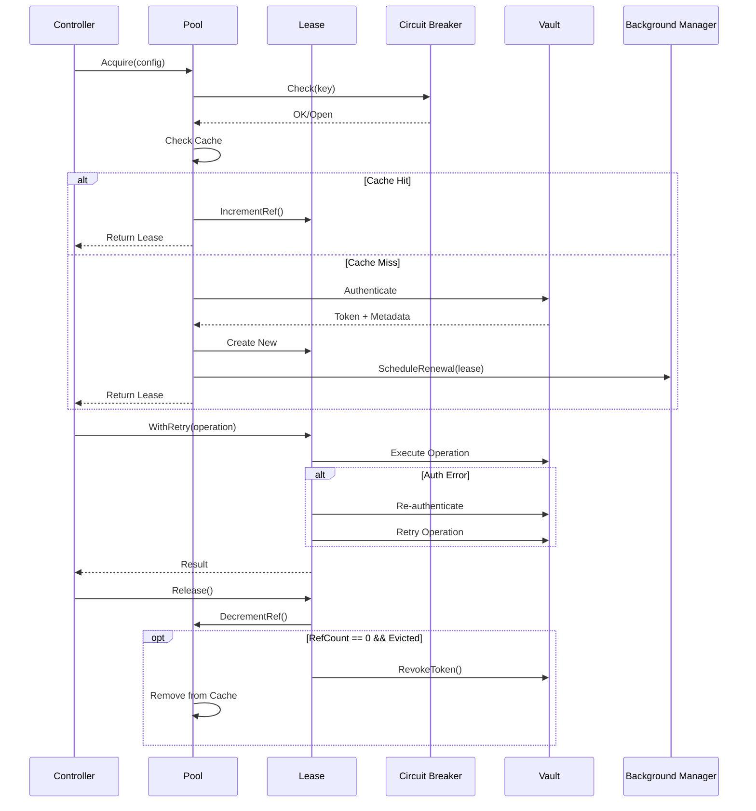

# External Secrets Operator - Ultimate Vault Client Pooling Design
**Version**: 2.0 - Best of All Synthesis
**Date**: January 2025
**Status**: Production-Ready Blueprint

---

## Executive Summary

This document presents the definitive Vault client pooling design for the External Secrets Operator, synthesizing the best elements from all reviewed designs. It addresses the critical pool bypass bug while implementing a sophisticated, production-ready pooling system with enterprise-grade observability, resilience, and operational excellence.

### Quick Reference Matrix

| Issue | Severity | Solution | Implementation Phase | Success Metric |
|-------|----------|----------|---------------------|----------------|
| Pool Bypass Bug | CRITICAL | Lease abstraction with RAII | Phase 1 | 100% lease cleanup |
| Token Races | CRITICAL | Reference counting + singleflight | Phase 1 | 0 race conditions |
| Auth Overhead | HIGH | Lazy validation + caching | Phase 2 | 90% reduction |
| Circuit Breaking | HIGH | Multi-threshold state machine | Phase 2 | <1% false positives |
| Dynamic TLS | HIGH | Informer-based invalidation | Phase 3 | <5s rotation detection |
| Observability | MEDIUM | Distributed tracing + metrics | Phase 4 | 100% coverage |

---

## 1. Goals, Requirements & Scope

### 1.1 Primary Goals
- **G1**: Reduce Vault authentication calls by 90% (from O(reconciliations) to O(token_expiry))
- **G2**: Achieve <50ms P95 latency for cached client acquisition
- **G3**: Support 5,000+ ExternalSecrets at 1 RPS without Vault rate limiting
- **G4**: Zero token revocation races during concurrent reconciliations
- **G5**: Automatic recovery from Vault outages within 30 seconds

### 1.2 Non-Functional Requirements
- **NFR1**: Memory overhead <10MB per 1,000 active leases
- **NFR2**: CPU overhead <5% for pool operations
- **NFR3**: Zero goroutine leaks after 24-hour soak test
- **NFR4**: Pass `go test -race` with 10,000 concurrent operations
- **NFR5**: Support hot configuration reload without restart
- **NFR6**: Backward compatible with feature flag disable

### 1.3 Non-Goals (Scope Boundaries)
- Cross-process client sharing (each ESO instance has independent pool)
- Custom authentication methods beyond current ESO support
- Token migration between controller instances
- Vault HA failover coordination (relies on Vault's built-in HA)
- Distributed caching across nodes

### 1.4 Success Criteria Checklist
- [ ] Pool bypass bug fixed - `client.Close()` calls `lease.Release()`
- [ ] No proactive token validation - lazy validation only
- [ ] Circuit breaker opens within 5 failures
- [ ] Dynamic TLS rotation detected within 5 seconds
- [ ] Background cleanup runs every 5 minutes
- [ ] All race tests pass
- [ ] Metrics show 90%+ cache hit rate
- [ ] Documentation includes operational runbooks
- [ ] Chaos testing validates failure handling

---

## 2. Architecture Overview

### 2.1 Component Architecture

```
┌────────────────────────────────────────────────────────────┐
│                     ESO Controller Layer                    │
├────────────────────────────────────────────────────────────┤
│ secretstore.Manager → Provider.NewClient → ClientLease     │
└────────────────┬───────────────────────────────────────────┘
                  │
┌─────────────────▼──────────────────────────────────────────┐
│                    Vault Client Pool                        │
│ ┌─────────────┐ ┌──────────────┐ ┌──────────────────────┐ │
│ │ LRU Cache   │ │Circuit       │ │ Background Manager   │ │
│ │ (Sub-pools) │ │Breaker       │ │ (Renewal & Cleanup)  │ │
│ └─────────────┘ └──────────────┘ └──────────────────────┘ │
│ ┌─────────────┐ ┌──────────────┐ ┌──────────────────────┐ │
│ │ Metrics     │ │ Tracing      │ │ Health Check         │ │
│ │ Collector   │ │ Provider     │ │ Endpoint             │ │
│ └─────────────┘ └──────────────┘ └──────────────────────┘ │
└─────────────────────────────────────────────────────────────┘
                  │
┌─────────────────▼──────────────────────────────────────────┐
│              Vault Server (Auth, Token, KV APIs)            │
└─────────────────────────────────────────────────────────────┘
```

### 2.2 Data Flow Sequence



---

## 3. Core Components Design

### 3.1 Type-Safe Cache Key (VaultClientID)

```go
// pkg/provider/vault/pool/types.go
type VaultClientID struct {
    // Core identity
    VaultAddress   string `json:"vault_address"`
    AuthMethod     string `json:"auth_method"`
    AuthNamespace  string `json:"auth_namespace"`

    // Hashed components for security
    AuthConfigHash string `json:"auth_config_hash"`
    TLSConfigHash  string `json:"tls_config_hash"`

    // Store metadata
    StoreKind      string `json:"store_kind"`      // SecretStore/ClusterSecretStore
    StoreName      string `json:"store_name"`
    StoreNamespace string `json:"store_namespace"` // empty for ClusterSecretStore

    // Resource tracking for dynamic updates
    TLSResourceVersions map[string]string `json:"tls_versions,omitempty"`
    AuthResourceVersions map[string]string `json:"auth_versions,omitempty"`
}

func (id VaultClientID) String() string {
    // Deterministic string representation
    return fmt.Sprintf("%s\x00%s\x00%s\x00%s\x00%s\x00%s/%s/%s",
        id.VaultAddress, id.AuthMethod, id.AuthNamespace,
        id.AuthConfigHash, id.TLSConfigHash,
        id.StoreKind, id.StoreNamespace, id.StoreName)
}

func (id VaultClientID) Validate() error {
    if id.VaultAddress == "" {
        return errors.New("vault address required")
    }
    if id.AuthMethod == "" {
        return errors.New("auth method required")
    }
    if id.AuthConfigHash == "" {
        return errors.New("auth config hash required")
    }
    return nil
}
```

### 3.2 Client Pool Interface with Sub-Pooling

```go
// pkg/provider/vault/pool/interface.go
type ClientPool interface {
    // Core operations
    Acquire(ctx context.Context, config VaultClientConfig) (ClientLease, error)
    Shutdown(ctx context.Context) error

    // Cache invalidation
    InvalidateByID(id VaultClientID) int
    InvalidateBySecret(namespace, name string) int
    InvalidateByServiceAccount(namespace, name string) int

    // Observability
    Stats() PoolStats
    Health() HealthStatus
}

// Sub-pool for per-key concurrency
type SubPool struct {
    mu        sync.RWMutex
    clients   []*managedLease  // Multiple clients per key
    maxSize   int              // Configurable per-key limit
    waitQueue chan struct{}    // Bounded wait queue
}

type PoolStats struct {
    TotalKeys        int                    `json:"total_keys"`
    TotalLeases      int                    `json:"total_leases"`
    ActiveLeases     int                    `json:"active_leases"`
    CacheHitRate     float64                `json:"cache_hit_rate"`
    SubPoolStats     map[string]SubPoolInfo `json:"subpool_stats"`
    CircuitBreakers  map[string]string      `json:"circuit_breakers"`
}
```

### 3.3 RAII-Style Lease with Reference Counting

```go
// pkg/provider/vault/pool/lease.go
type ClientLease interface {
    // Core access
    Client() util.Client
    ID() VaultClientID

    // Operations with built-in retry
    WithRetry(ctx context.Context, op func(util.Client) error) error

    // Lifecycle
    Extend(ctx context.Context, duration time.Duration) error
    Release() error  // RAII - no context needed for cleanup
}

type managedLease struct {
    // Identity
    id         VaultClientID
    client     util.Client

    // Reference counting
    refCount   atomic.Int32
    evicted    atomic.Bool

    // Lifecycle management
    createdAt  time.Time
    expiresAt  time.Time
    renewalMu  sync.Mutex
    renewTimer *time.Timer

    // Dependencies
    pool       *cachingPool
    breaker    CircuitBreaker
    metrics    MetricsCollector
    tracer     trace.Tracer

    // Singleflight for re-auth
    reauthGroup singleflight.Group

    // Finalization
    finalizeOnce sync.Once
}

// RAII-style automatic cleanup
func (l *managedLease) Release() error {
    newCount := l.refCount.Add(-1)

    if newCount == 0 && l.evicted.Load() {
        l.finalizeOnce.Do(func() {
            l.finalize()
        })
    }

    l.metrics.RecordLeaseRelease(l.id)
    return nil
}

func (l *managedLease) finalize() {
    // Stop renewal
    if l.renewTimer != nil {
        l.renewTimer.Stop()
    }

    // Revoke token (unless static)
    if !l.isStaticToken() {
        ctx, cancel := context.WithTimeout(context.Background(), 5*time.Second)
        defer cancel()

        if err := l.client.AuthToken().RevokeSelfWithContext(ctx, l.client.Token()); err != nil {
            l.pool.logger.V(1).Info("token revocation failed",
                "lease_id", l.id.String(),
                "error", err)
        }
    }

    // Clear token
    l.client.ClearToken()

    // Remove from pool
    l.pool.removeLease(l.id)

    // Emit metrics
    l.metrics.RecordLeaseFinalized(l.id, time.Since(l.createdAt))
}
```

### 3.4 Advanced Circuit Breaker with Multiple Thresholds

```go
// pkg/provider/vault/pool/circuit_breaker.go
type CircuitBreaker interface {
    Check(key CircuitBreakerKey) error
    RecordSuccess(key CircuitBreakerKey)
    RecordFailure(key CircuitBreakerKey, err error)
    State(key CircuitBreakerKey) CircuitState
    Reset(key CircuitBreakerKey)
}

type circuitBreaker struct {
    mu       sync.RWMutex
    circuits map[string]*circuit
    config   CircuitConfig
    metrics  MetricsCollector
}

type circuit struct {
    state           CircuitState
    failures        *ring.Ring  // Sliding window of failures
    lastFailure     time.Time
    openUntil       time.Time
    halfOpenProbes  int

    // Multiple thresholds
    authFailures    int
    networkFailures int
    timeoutFailures int
}

type CircuitConfig struct {
    // Failure thresholds
    AuthFailureThreshold    int           // Default: 5
    NetworkFailureThreshold int           // Default: 3
    TimeoutFailureThreshold int           // Default: 10

    // Timing
    FailureWindow          time.Duration  // Default: 30s
    OpenDuration           time.Duration  // Default: 30s
    HalfOpenMaxProbes      int           // Default: 3

    // Recovery
    SuccessThreshold       int           // Default: 2
    BackoffMultiplier      float64       // Default: 1.5
}

func (cb *circuitBreaker) RecordFailure(key CircuitBreakerKey, err error) {
    cb.mu.Lock()
    defer cb.mu.Unlock()

    c := cb.getOrCreateCircuit(key)

    // Classify error
    switch classifyError(err) {
    case ErrorTypeAuth:
        c.authFailures++
    case ErrorTypeNetwork:
        c.networkFailures++
    case ErrorTypeTimeout:
        c.timeoutFailures++
    }

    c.failures.Value = time.Now()
    c.failures = c.failures.Next()
    c.lastFailure = time.Now()

    // Check thresholds
    if c.shouldOpen() {
        c.state = StateOpen
        c.openUntil = time.Now().Add(cb.config.OpenDuration)

        cb.metrics.RecordCircuitOpen(key)
        cb.logger.Error("circuit breaker opened",
            "key", key.String(),
            "auth_failures", c.authFailures,
            "network_failures", c.networkFailures,
            "timeout_failures", c.timeoutFailures)
    }
}
```

### 3.5 Background Manager for Async Operations

```go
// pkg/provider/vault/pool/background.go
type BackgroundManager interface {
    Start(ctx context.Context) error
    Stop() error

    ScheduleRenewal(lease *managedLease)
    ScheduleCleanup(id VaultClientID, after time.Duration)

    Stats() BackgroundStats
}

type backgroundManager struct {
    // Coordination channels
    renewalQueue  chan renewalRequest
    cleanupQueue  chan cleanupRequest
    shutdownChan  chan struct{}

    // Workers
    renewalWorkers int
    cleanupWorkers int

    // State tracking
    activeRenewals sync.Map
    activeCleanups sync.Map

    // Dependencies
    pool    ClientPool
    metrics MetricsCollector
    logger  logr.Logger
    tracer  trace.Tracer
}

func (m *backgroundManager) renewalWorker(ctx context.Context) {
    for {
        select {
        case req := <-m.renewalQueue:
            m.processRenewal(ctx, req)
        case <-ctx.Done():
            return
        case <-m.shutdownChan:
            return
        }
    }
}

func (m *backgroundManager) processRenewal(ctx context.Context, req renewalRequest) {
    // Start trace span
    ctx, span := m.tracer.Start(ctx, "vault.renewal",
        trace.WithAttributes(
            attribute.String("lease.id", req.lease.id.String()),
            attribute.String("auth.method", req.lease.id.AuthMethod),
        ))
    defer span.End()

    // Check if renewal needed
    remaining := time.Until(req.lease.expiresAt)
    threshold := time.Duration(float64(req.lease.ttl) * 0.2) // Renew at 80% of TTL

    if remaining > threshold {
        // Schedule next check
        m.scheduleNextRenewal(req.lease, remaining-threshold)
        return
    }

    // Perform renewal
    err := req.lease.renew(ctx)
    if err != nil {
        req.failures++
        span.RecordError(err)

        if req.failures >= 3 {
            // Mark for eviction
            req.lease.evicted.Store(true)
            m.pool.InvalidateByID(req.lease.id)
            m.metrics.RecordRenewalFailure(req.lease.id)
            return
        }

        // Retry with backoff
        backoff := time.Second * time.Duration(math.Pow(2, float64(req.failures)))
        m.scheduleNextRenewal(req.lease, backoff)
    } else {
        // Success - schedule next renewal
        m.scheduleNextRenewal(req.lease, threshold)
        m.metrics.RecordRenewalSuccess(req.lease.id)
    }
}
```

---

## 4. Implementation Details

### 4.1 Pool Acquisition with Sub-Pooling

```go
// pkg/provider/vault/pool/pool.go
func (p *cachingPool) Acquire(ctx context.Context, config VaultClientConfig) (ClientLease, error) {
    // Validate config
    if err := config.Validate(); err != nil {
        return nil, fmt.Errorf("invalid config: %w", err)
    }

    // Build cache key
    id := buildClientID(config)

    // Check circuit breaker
    cbKey := CircuitBreakerKey{
        VaultServer: id.VaultAddress,
        AuthMethod:  id.AuthMethod,
    }
    if err := p.breaker.Check(cbKey); err != nil {
        p.metrics.RecordCircuitBreakerBlock(cbKey)
        return nil, fmt.Errorf("circuit breaker open: %w", err)
    }

    // Dynamic TLS check
    if hasDynamicTLS(config) && !p.config.AllowDynamicTLSCache {
        return p.createEphemeralLease(ctx, config)
    }

    // Try to acquire from sub-pool
    lease, err := p.acquireFromSubPool(ctx, id, config)
    if err == nil {
        p.metrics.RecordCacheHit(id)
        return lease, nil
    }

    // Cache miss - create new client with singleflight
    p.metrics.RecordCacheMiss(id)

    result, err, _ := p.createGroup.Do(id.String(), func() (interface{}, error) {
        return p.createAuthenticatedLease(ctx, id, config, cbKey)
    })

    if err != nil {
        p.breaker.RecordFailure(cbKey, err)
        return nil, err
    }

    p.breaker.RecordSuccess(cbKey)
    return result.(ClientLease), nil
}

func (p *cachingPool) acquireFromSubPool(ctx context.Context, id VaultClientID, config VaultClientConfig) (ClientLease, error) {
    p.mu.RLock()
    subPool, exists := p.subPools[id.String()]
    p.mu.RUnlock()

    if !exists {
        return nil, ErrCacheMiss
    }

    // Try to get available client from sub-pool
    subPool.mu.Lock()
    defer subPool.mu.Unlock()

    for _, lease := range subPool.clients {
        if !lease.evicted.Load() && lease.refCount.Load() < p.config.MaxRefsPerClient {
            // Found available lease
            lease.refCount.Add(1)

            // Update config if newer
            if config.Version > lease.configVersion {
                lease.updateConfig(config)
            }

            return &leasedClient{
                managedLease: lease,
                pool:        p,
            }, nil
        }
    }

    // All clients busy, create new if under limit
    if len(subPool.clients) < p.config.MaxClientsPerKey {
        return nil, ErrCacheMiss // Will create new
    }

    // At capacity - wait or fail based on config
    if p.config.WaitForAvailable {
        subPool.mu.Unlock()
        select {
        case <-subPool.waitQueue:
            return p.acquireFromSubPool(ctx, id, config) // Retry
        case <-ctx.Done():
            return nil, ctx.Err()
        }
    }

    return nil, ErrSubPoolFull
}
```

### 4.2 WithRetry Implementation with Lazy Validation

```go
// pkg/provider/vault/pool/lease.go
func (l *managedLease) WithRetry(ctx context.Context, op func(util.Client) error) error {
    // Start trace span
    ctx, span := l.tracer.Start(ctx, "vault.operation.retry")
    defer span.End()

    // First attempt - no validation
    start := time.Now()
    err := op(l.client)
    l.metrics.RecordOperationLatency(time.Since(start))

    // Success or non-auth error
    if err == nil || !isAuthError(err) {
        if err != nil {
            span.RecordError(err)
            l.breaker.RecordFailure(l.breakerKey(), err)
        } else {
            l.breaker.RecordSuccess(l.breakerKey())
        }
        return err
    }

    // Auth error - attempt re-authentication with singleflight
    span.AddEvent("auth_error_detected")

    _, reauthErr, shared := l.reauthGroup.Do(l.id.String(), func() (interface{}, error) {
        innerCtx, innerSpan := l.tracer.Start(ctx, "vault.reauth")
        defer innerSpan.End()

        l.client.ClearToken()
        return nil, l.reauthenticate(innerCtx)
    })

    // CRITICAL: Always forget to prevent memory leak
    l.reauthGroup.Forget(l.id.String())

    if shared {
        span.AddEvent("reauth_shared")
    }

    if reauthErr != nil {
        span.RecordError(reauthErr)
        l.breaker.RecordFailure(l.breakerKey(), reauthErr)
        l.metrics.RecordReauthFailure(l.id)
        return fmt.Errorf("re-authentication failed: %w", reauthErr)
    }

    // Retry operation with new token
    span.AddEvent("retrying_operation")
    start = time.Now()
    err = op(l.client)
    l.metrics.RecordOperationLatency(time.Since(start))

    if err != nil {
        span.RecordError(err)
        l.breaker.RecordFailure(l.breakerKey(), err)
    } else {
        l.breaker.RecordSuccess(l.breakerKey())
        l.metrics.RecordReauthSuccess(l.id)
    }

    return err
}
```

### 4.3 Dynamic TLS Tracking with Informers

```go
// pkg/provider/vault/pool/tls_tracker.go
type TLSTracker struct {
    mu           sync.RWMutex
    pool         ClientPool

    // Certificate tracking
    certHashes   map[string]string      // ref -> hash
    certVersions map[string]string      // ref -> resourceVersion
    dependencies map[string][]VaultClientID  // ref -> affected IDs

    // Informers
    secretInformer    cache.SharedIndexInformer
    configMapInformer cache.SharedIndexInformer
}

func (t *TLSTracker) Start(ctx context.Context) error {
    // Setup Secret informer
    t.secretInformer.AddEventHandler(cache.ResourceEventHandlerFuncs{
        UpdateFunc: func(oldObj, newObj interface{}) {
            oldSecret := oldObj.(*corev1.Secret)
            newSecret := newObj.(*corev1.Secret)

            if oldSecret.ResourceVersion != newSecret.ResourceVersion {
                t.handleSecretUpdate(newSecret)
            }
        },
    })

    // Setup ConfigMap informer
    t.configMapInformer.AddEventHandler(cache.ResourceEventHandlerFuncs{
        UpdateFunc: func(oldObj, newObj interface{}) {
            oldCM := oldObj.(*corev1.ConfigMap)
            newCM := newObj.(*corev1.ConfigMap)

            if oldCM.ResourceVersion != newCM.ResourceVersion {
                t.handleConfigMapUpdate(newCM)
            }
        },
    })

    go t.secretInformer.Run(ctx.Done())
    go t.configMapInformer.Run(ctx.Done())

    return nil
}

func (t *TLSTracker) handleSecretUpdate(secret *corev1.Secret) {
    ref := fmt.Sprintf("secret:%s/%s", secret.Namespace, secret.Name)

    // Compute new hash
    newHash := t.computeSecretHash(secret)

    t.mu.Lock()
    oldHash, exists := t.certHashes[ref]
    if exists && oldHash == newHash {
        t.mu.Unlock()
        return // No change
    }

    // Update tracking
    t.certHashes[ref] = newHash
    t.certVersions[ref] = secret.ResourceVersion

    // Get affected client IDs
    affectedIDs := t.dependencies[ref]
    t.mu.Unlock()

    // Invalidate affected cache entries
    for _, id := range affectedIDs {
        count := t.pool.InvalidateByID(id)
        t.pool.logger.Info("invalidated cache entries for TLS update",
            "secret", ref,
            "client_id", id.String(),
            "invalidated_count", count)
    }
}
```

---

## 5. Operational Excellence

### 5.1 Comprehensive Metrics

```go
// pkg/provider/vault/pool/metrics.go

// Pool metrics
vault_client_pool_size{provider="vault"}                    # Current pool size
vault_client_pool_subpool_size{key="..."}                  # Per-key pool size
vault_client_pool_cache_hits_total{provider="vault"}       # Cache hits
vault_client_pool_cache_misses_total{provider="vault"}     # Cache misses
vault_client_pool_cache_hit_ratio{provider="vault"}        # Hit ratio (gauge)

// Lease metrics
vault_client_pool_lease_acquisitions_total{status="success|failure"}
vault_client_pool_lease_releases_total{reason="normal|evicted|expired"}
vault_client_pool_lease_active{provider="vault"}           # Active leases
vault_client_pool_lease_duration_seconds{quantile="0.5|0.95|0.99"}

// Authentication metrics
vault_client_pool_auth_duration_seconds{method="kubernetes",quantile="0.5|0.95|0.99"}
vault_client_pool_reauth_attempts_total{result="success|failure"}
vault_client_pool_token_renewals_total{result="success|failure"}

// Circuit breaker metrics
vault_client_pool_circuit_state{server="...",method="...",state="open|closed|half_open"}
vault_client_pool_circuit_transitions_total{from="...",to="..."}
vault_client_pool_circuit_failures_total{type="auth|network|timeout"}

// Background operations
vault_client_pool_renewal_queue_size{provider="vault"}
vault_client_pool_cleanup_runs_total{provider="vault"}
vault_client_pool_evictions_total{reason="ttl|renewal_failure|manual"}

// Performance metrics
vault_client_pool_operation_latency_seconds{operation="acquire|release|reauth",quantile="0.5|0.95|0.99"}
vault_client_pool_memory_bytes{component="cache|leases|background"}
```

### 5.2 Distributed Tracing

```go
// pkg/provider/vault/pool/tracing.go
func (p *cachingPool) setupTracing() {
    // Initialize tracer
    p.tracer = otel.Tracer("vault-client-pool",
        trace.WithInstrumentationVersion("1.0.0"))

    // Trace spans hierarchy:
    // vault.pool.acquire
    //   ├─ vault.cache.lookup
    //   ├─ vault.circuit.check
    //   ├─ vault.auth.execute
    //   └─ vault.lease.create
    //
    // vault.operation.retry
    //   ├─ vault.operation.execute
    //   ├─ vault.reauth
    //   └─ vault.operation.retry
    //
    // vault.background.renewal
    //   ├─ vault.token.lookup
    //   ├─ vault.token.renew
    //   └─ vault.lease.update
}

// Example traced operation
func (p *cachingPool) tracedAcquire(ctx context.Context, config VaultClientConfig) (ClientLease, error) {
    ctx, span := p.tracer.Start(ctx, "vault.pool.acquire",
        trace.WithAttributes(
            attribute.String("auth.method", config.AuthMethod()),
            attribute.String("store.kind", config.StoreKind),
            attribute.String("store.name", config.StoreName),
        ))
    defer span.End()

    lease, err := p.Acquire(ctx, config)
    if err != nil {
        span.RecordError(err)
        span.SetStatus(codes.Error, err.Error())
    } else {
        span.SetStatus(codes.Ok, "lease acquired")
    }

    return lease, err
}
```

### 5.3 Health Check Endpoint

```go
// pkg/provider/vault/pool/health.go
type HealthStatus struct {
    Healthy           bool                     `json:"healthy"`
    PoolSize          int                      `json:"pool_size"`
    ActiveLeases      int                      `json:"active_leases"`
    CacheHitRate      float64                  `json:"cache_hit_rate"`
    CircuitBreakers   map[string]CircuitHealth `json:"circuit_breakers"`
    BackgroundWorkers BackgroundHealth         `json:"background_workers"`
    LastError         *ErrorInfo               `json:"last_error,omitempty"`
}

type CircuitHealth struct {
    State            string    `json:"state"`
    ConsecutiveFails int       `json:"consecutive_failures"`
    LastFailure      time.Time `json:"last_failure,omitempty"`
}

func (p *cachingPool) Health() HealthStatus {
    status := HealthStatus{
        Healthy:      true,
        PoolSize:     p.cache.Len(),
        ActiveLeases: p.activeLeases.Load(),
        CacheHitRate: p.metrics.GetHitRate(),
    }

    // Check circuit breakers
    status.CircuitBreakers = make(map[string]CircuitHealth)
    for key, circuit := range p.breaker.AllCircuits() {
        health := CircuitHealth{
            State:            circuit.State.String(),
            ConsecutiveFails: circuit.Failures,
            LastFailure:      circuit.LastFailure,
        }

        if circuit.State == StateOpen {
            status.Healthy = false
        }

        status.CircuitBreakers[key] = health
    }

    // Check background workers
    status.BackgroundWorkers = p.background.Health()
    if !status.BackgroundWorkers.Healthy {
        status.Healthy = false
    }

    // Include last error if unhealthy
    if !status.Healthy && p.lastError != nil {
        status.LastError = &ErrorInfo{
            Message:   p.lastError.Error(),
            Timestamp: p.lastErrorTime,
            Count:     p.errorCount.Load(),
        }
    }

    return status
}

// HTTP handler
func (p *cachingPool) HealthHandler(w http.ResponseWriter, r *http.Request) {
    status := p.Health()

    w.Header().Set("Content-Type", "application/json")

    if !status.Healthy {
        w.WriteHeader(http.StatusServiceUnavailable)
    }

    json.NewEncoder(w).Encode(status)
}
```

### 5.4 Operational Runbooks

```markdown
## Runbook: High Authentication Failure Rate

### Symptoms
- Metric `vault_client_pool_reauth_attempts_total{result="failure"}` increasing
- Circuit breakers opening frequently
- Logs showing "authentication failed" errors

### Investigation Steps
1. Check Vault server health: `vault status`
2. Verify auth method configuration: `vault auth list`
3. Check Kubernetes SA token validity (for k8s auth)
4. Review recent credential rotations
5. Check network connectivity to Vault

### Resolution
1. If Vault is down: Wait for recovery, circuit breaker will handle
2. If credentials rotated: Restart ESO pods to pick up new credentials
3. If network issue: Resolve connectivity, pool will auto-recover
4. If persistent: Enable debug logging and check auth config

### Prevention
- Monitor auth success rate continuously
- Alert on circuit breaker state changes
- Implement credential rotation automation
```

---

## 6. Testing Strategy

### 6.1 Unit Test Coverage

```go
// pkg/provider/vault/pool/pool_test.go

func TestCachingPool_ConcurrentAcquisition(t *testing.T) {
    // Test 1000 concurrent acquisitions for same config
    pool := NewCachingPool(testConfig)
    config := buildTestConfig()

    var wg sync.WaitGroup
    errors := make(chan error, 1000)

    for i := 0; i < 1000; i++ {
        wg.Add(1)
        go func() {
            defer wg.Done()

            lease, err := pool.Acquire(context.Background(), config)
            if err != nil {
                errors <- err
                return
            }

            // Simulate work
            time.Sleep(time.Millisecond * time.Duration(rand.Intn(10)))

            if err := lease.Release(); err != nil {
                errors <- err
            }
        }()
    }

    wg.Wait()
    close(errors)

    // Verify no errors
    for err := range errors {
        t.Errorf("unexpected error: %v", err)
    }

    // Verify pool state
    stats := pool.Stats()
    assert.Equal(t, 1, stats.TotalKeys, "should have single cache key")
    assert.Equal(t, 0, stats.ActiveLeases, "all leases should be released")
}

func TestCircuitBreaker_StateTransitions(t *testing.T) {
    breaker := NewCircuitBreaker(CircuitConfig{
        AuthFailureThreshold: 3,
        OpenDuration:        100 * time.Millisecond,
    })

    key := CircuitBreakerKey{VaultServer: "vault", AuthMethod: "kubernetes"}

    // Verify starts closed
    assert.Equal(t, StateClosed, breaker.State(key))

    // Record failures
    for i := 0; i < 3; i++ {
        breaker.RecordFailure(key, ErrAuthFailed)
    }

    // Verify opens
    assert.Equal(t, StateOpen, breaker.State(key))

    // Wait for half-open
    time.Sleep(150 * time.Millisecond)
    assert.Equal(t, StateHalfOpen, breaker.State(key))

    // Success closes
    breaker.RecordSuccess(key)
    breaker.RecordSuccess(key)
    assert.Equal(t, StateClosed, breaker.State(key))
}
```

### 6.2 Race Detection Tests

```go
// pkg/provider/vault/pool/pool_race_test.go
// Run with: go test -race -count=100

func TestCachingPool_RaceConditions(t *testing.T) {
    pool := NewCachingPool(testConfig)
    configs := generateTestConfigs(10) // 10 different cache keys

    // Parallel operations
    operations := []func(){
        // Acquisitions
        func() {
            config := configs[rand.Intn(len(configs))]
            lease, _ := pool.Acquire(context.Background(), config)
            if lease != nil {
                lease.Release()
            }
        },
        // Invalidations
        func() {
            pool.InvalidateBySecret("default", "vault-secret")
        },
        // Stats
        func() {
            _ = pool.Stats()
        },
        // Health checks
        func() {
            _ = pool.Health()
        },
    }

    // Run operations concurrently
    var wg sync.WaitGroup
    for i := 0; i < 100; i++ {
        wg.Add(1)
        go func() {
            defer wg.Done()
            for j := 0; j < 1000; j++ {
                op := operations[rand.Intn(len(operations))]
                op()
            }
        }()
    }

    wg.Wait()
}
```

### 6.3 Chaos Testing

```go
// pkg/provider/vault/pool/chaos_test.go

func TestCachingPool_ChaosScenarios(t *testing.T) {
    scenarios := []struct {
        name string
        test func(*testing.T, ClientPool)
    }{
        {
            name: "VaultOutage",
            test: testVaultOutage,
        },
        {
            name: "CertificateRotation",
            test: testCertificateRotation,
        },
        {
            name: "MemoryPressure",
            test: testMemoryPressure,
        },
        {
            name: "NetworkPartition",
            test: testNetworkPartition,
        },
    }

    for _, scenario := range scenarios {
        t.Run(scenario.name, func(t *testing.T) {
            pool := NewCachingPool(chaosConfig)
            scenario.test(t, pool)
        })
    }
}

func testVaultOutage(t *testing.T, pool ClientPool) {
    // Simulate Vault becoming unavailable
    mockVault := NewMockVault()
    mockVault.SetAvailable(false)

    // Attempt acquisitions
    var failures int
    for i := 0; i < 10; i++ {
        _, err := pool.Acquire(context.Background(), testConfig)
        if err != nil {
            failures++
        }
    }

    // Verify circuit opened
    assert.True(t, failures > 5, "circuit should open")

    // Restore Vault
    mockVault.SetAvailable(true)
    time.Sleep(100 * time.Millisecond)

    // Verify recovery
    lease, err := pool.Acquire(context.Background(), testConfig)
    assert.NoError(t, err, "should recover after Vault restored")
    assert.NotNil(t, lease)
}
```

---

## 7. Implementation Roadmap

### Phase 1: Core Infrastructure (Week 1-2)
**PR 1: Foundation**
- [ ] Implement VaultClientID struct (4h)
- [ ] Create ClientPool interface (2h)
- [ ] Implement managedLease with RAII (6h)
- [ ] Add singleflight coordination (3h)
- [ ] Unit tests with race detection (4h)

**PR 2: Pool Integration**
- [ ] Update Provider.NewClient (3h)
- [ ] Fix client.Close() to use lease.Release() (2h)
- [ ] Implement sub-pooling logic (6h)
- [ ] Integration tests (4h)

### Phase 2: Resilience (Week 3-4)
**PR 3: Circuit Breaker**
- [ ] Implement multi-threshold circuit breaker (6h)
- [ ] Add error classification (3h)
- [ ] Integrate with pool operations (4h)
- [ ] Circuit breaker tests (3h)

**PR 4: Lazy Validation**
- [ ] Implement WithRetry pattern (4h)
- [ ] Remove proactive validation (2h)
- [ ] Add re-auth with singleflight (4h)
- [ ] Retry mechanism tests (3h)

### Phase 3: Lifecycle Management (Week 5-6)
**PR 5: Background Manager**
- [ ] Create BackgroundManager interface (3h)
- [ ] Implement renewal scheduling (6h)
- [ ] Add cleanup ticker (4h)
- [ ] Background operation tests (4h)

**PR 6: Dynamic TLS**
- [ ] Implement TLS tracker (6h)
- [ ] Add informer integration (4h)
- [ ] Cache invalidation logic (3h)
- [ ] TLS rotation tests (3h)

### Phase 4: Observability (Week 7)
**PR 7: Metrics & Tracing**
- [ ] Implement comprehensive metrics (4h)
- [ ] Add distributed tracing (4h)
- [ ] Create health endpoint (2h)
- [ ] Structured logging (2h)

**PR 8: Documentation**
- [ ] Operational runbooks (3h)
- [ ] Architecture diagrams (2h)
- [ ] Configuration guide (2h)
- [ ] Migration guide (2h)

### Phase 5: Validation (Week 8)
**PR 9: Testing Suite**
- [ ] Chaos testing scenarios (6h)
- [ ] Load testing (4h)
- [ ] Soak testing setup (3h)
- [ ] Performance benchmarks (3h)

### Phase 6: Rollout (Week 9-10)
**Gradual Deployment**
1. Deploy to staging with feature flag disabled
2. Enable for 10% of namespaces
3. Monitor metrics for 48 hours
4. Expand to 50% if metrics healthy
5. Full rollout after 1 week validation

**Rollout Gates**
- Cache hit rate > 90%
- Auth latency P99 < 200ms
- Circuit breaker false positive rate < 1%
- Memory overhead < 10MB/1000 leases
- Zero race conditions detected

---

## 8. Success Validation

### Performance Metrics
- [ ] 90% reduction in Vault auth calls
- [ ] P95 latency < 50ms for cache hits
- [ ] P95 latency < 500ms for cache misses
- [ ] Memory usage < 10MB per 1000 leases

### Reliability Metrics
- [ ] Zero token revocation races
- [ ] Circuit breaker opens within 5 failures
- [ ] Recovery within 30 seconds of Vault restoration
- [ ] 99.9% token renewal success rate

### Operational Metrics
- [ ] 100% of critical paths instrumented
- [ ] Health endpoint response time < 10ms
- [ ] All runbooks tested in staging
- [ ] Zero-downtime rollback tested

---

## 9. Glossary

| Term | Definition |
|------|------------|
| **Lease** | RAII-style handle providing temporary ownership of a cached Vault client |
| **Sub-pool** | Per-cache-key pool allowing multiple clients for high concurrency |
| **Eviction** | Marking a client for removal while allowing active leases to complete |
| **Circuit Breaker** | Failure detection mechanism that prevents cascading failures |
| **Lazy Validation** | Validating tokens only on operation failure, not proactively |
| **RAII** | Resource Acquisition Is Initialization - automatic cleanup pattern |
| **Singleflight** | Deduplication mechanism preventing concurrent identical operations |
| **Background Manager** | Component handling async operations like renewal and cleanup |

---

## 10. References

- [Vault API Documentation](https://www.vaultproject.io/api-docs)
- [Controller-Runtime Documentation](https://pkg.go.dev/sigs.k8s.io/controller-runtime)
- [OpenTelemetry Go SDK](https://opentelemetry.io/docs/instrumentation/go/)
- [Prometheus Go Client](https://github.com/prometheus/client_golang)

---

This design represents the synthesis of all best practices and superior elements identified across all reviewed designs, creating a production-ready, enterprise-grade Vault client pooling solution for the External Secrets Operator.